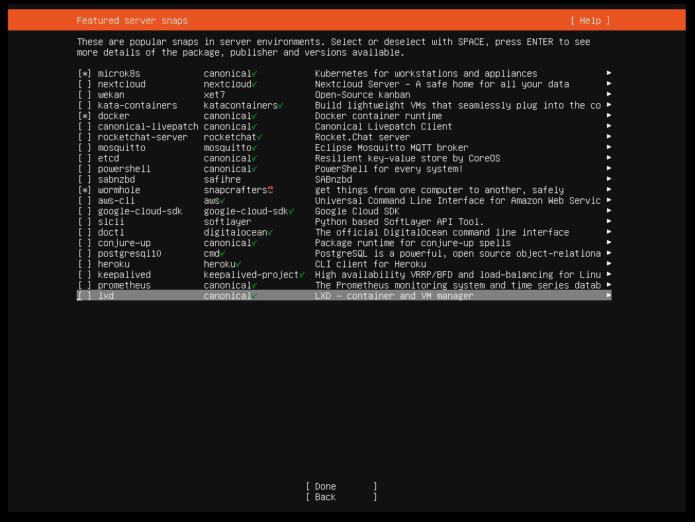

## Ambiente para processamento paralelo e distribuído em contêineres 
Este respositório agrupa os respositórios necessários para a configuração e execução do meu trabalho de conclusão de curso. 
[Monografia](https://drive.google.com/file/d/1UB2EZ1kENSQaQ6L3jCuwzog4L10oQKy_/view)
### Setup

O primeiro passo para executar este projeto é ter disponível algumas máquinas rodando Ubuntu Server 22.04 ligadas em rede. Neste projeto foi usado um cluster disponibilizado pela UFPEL. As configurações das máquinas são as seguintes:
- Intel Core i5 de 3a geração
- 16 GB de memória RAM
- SSDs de 128 GB.

Alguns pacotes foram instalados durante a instalação do SO, mas essa etapa pode ser feita posteriormente. Mas para exemplificar foram feitos alguns print screens.

- MicroK8s: Ferramenta principal para configurar o ambiente Kubernetes, responsável pelo orquestramento de contêineres;


- Docker: Ambiente de virtualização utilizado para a criação e gestão de imagens de contêineres;




### Arquitetura geral do projeto
O projeto utiliza 4 máquinas, mas isso pode ser extendido de forma fácil. A primeira máquina é a manager e ela vai ser responsável pela orquestração dos nós, uma máquina vai ser responsável pelo armazenamento dos artefatos gerados por cada execução enviada ao ambiente, mas esse repositório poderia ser configurado no manager, e por fim as máquinas que serão os nós. 


### Configuração do Ambiente Kubernetes

Após a instalação das dependências, prossiga com a configuração do MicroK8s
na máquina designada como manager. Primeiro é necessário que acesse o repositório
[devops](https://github.com/banguense/devops)Em seguida, execute o seguinte script que se encontra dentro do repositório:

```sh 
./ config_microk8s.sh
```

script acima realiza automaticamente as seguintes ações:

1. Ativação da configuração do Kubernetes;
2. Configuração do sistema de armazenamento persistente;
3. Implementação de políticas de segurança.

### Implementação do Servidor NFS

Para garantir a persistência dos dados entre os nós do cluster, é necessário implementar um servidor NFS (Network File System). Siga os passos abaixo na máquina designada como servidor NFS:

1. **Instalação dos pacotes necessários**:
    ```sh
    sudo apt-get install nfs-kernel-server nfs-common -y
    ```

2. **Criação do diretório compartilhado**:
    ```sh
    sudo mkdir -p /srv/nfs
    sudo chmod -R 777 /srv/nfs
    sudo chown nobody:nogroup /srv/nfs
    ```

3. **Configuração do arquivo de exportação**:
    ```sh
    echo "/srv/nfs *(rw,sync,no_subtree_check,no_root_squash)" | sudo tee -a /etc/exports
    ```

4. **Ativação e inicialização do serviço**:
    ```sh
    sudo exportfs -a
    sudo systemctl restart nfs-kernel-server
    sudo systemctl enable nfs-kernel-server
    ```

5. **Configuração do firewall (opcional)**:
    ```sh
    sudo ufw allow from 192.168.0.0/24 to any port nfs
    sudo ufw reload
    ```

**Configuração dos nós Workers para acesso ao NFS**:

Nos nós workers que precisarem acessar o compartilhamento NFS, execute:
```sh
sudo apt-get install nfs-common -y
sudo mkdir -p /mnt/nfs
sudo mount -t nfs <IP-DO-SERVIDOR-NFS>:/srv/nfs /mnt/nfs
```

Para montagem automática durante o boot, adicione ao arquivo `/etc/fstab`:
```sh
<IP-DO-SERVIDOR-NFS>:/srv/nfs /mnt/nfs nfs defaults 0 0
```

**Nota**: Substitua `<IP-DO-SERVIDOR-NFS>` pelo endereço IP real do servidor NFS. Teste o compartilhamento com arquivos de teste antes do uso em produção.


### Integração do NFS ao Kubernetes

Após configurar o servidor NFS, atualize o arquivo `sc-nfs.yaml` substituindo o campo:
```yaml
server: <IP-DO-HOST-NFS>
```
pelo IP real do servidor NFS. Em seguida, execute na máquina *manager*:
```sh
./config_nfs.sh
./manager_config.sh
```

**Configuração de Segurança**:
No script `manager_config.sh`, atualize o parâmetro em `application.properties`:
```properties
app.accessKey=<CHAVE_DE_ACESSO>
```
Gere uma chave segura com:
```sh
openssl rand -base64 42
```


### Integração de nós Workers

Para adicionar nós workers ao cluster:

1. Na máquina *manager*, gere o token de integração:
    ```sh
    microk8s add-node
    ```
    Saída esperada (exemplo):
    ```sh
    microk8s join 192.168.0.101:25000/aaaaaaaaaaaaaaaaaaaaaaaaaa/aaaaaaaaaa --worker
    ```

2. **Nos nós workers**:
    - Crie o diretório de configuração do Kubernetes:
        ```sh
        mkdir ~/.kube
        ```
    - Exporte a configuração do MicroK8s:
        ```sh
        sudo microk8s config > ~/.kube/config
        ```
    - Execute o comando de junção fornecido pelo *manager*.

